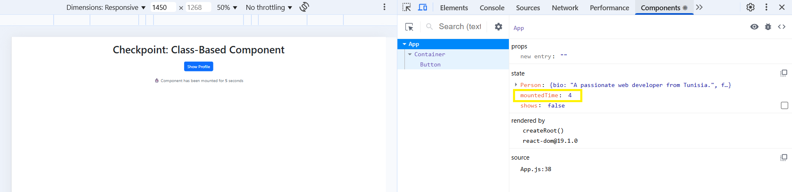
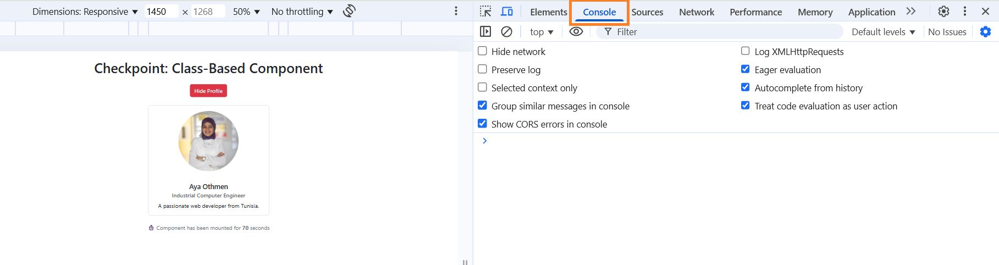

## 🐛 Debugging Report

### 🔍 Goal
Use React Developer Tools to inspect and debug the application’s component tree, state, and behavior.

### ✅ Observations
- Opened the app using `npm start`
- Used React Developer Tools to inspect the `<App>` component
- Verified:
  - `state` includes `Person`, `shows`, and `mountedTime`
  - `mountedTime` increments every second
  - `shows` toggles correctly on button click
  - Profile displays all fields correctly when `shows` is `true`
  - No warnings or errors in console
  - Image source is valid
  - UI behaves as expected with no unexpected rendering or prop/state issues

---

### 🖼️ Screenshots

#### 🔧 React Dev Tools – App Component State
> Shows correct structure of the `App` component’s state: `Person`, `shows`, `mountedTime`.

| With Profile (`shows: true`) | Without Profile (`shows: false`) |
|------------------------------|-------------------------------|
|  |  |

---

#### 🔁 React Dev Tools – Timer State
> Confirms `componentDidMount` was called and `mountedTime` is updating every second.

| mountedTime = 4 seconds | mountedTime = 14 seconds |
|-------------------------|--------------------------|
|  |  |

---

#### 🛑 Console – No Warnings or Errors
> Demonstrates a clean console with no React warnings or errors.

---

### 🧩 Conclusion
No bugs or issues were found during inspection. All components behave correctly, state updates as expected, and lifecycle methods are functioning properly. The debugging tools confirmed the application is stable and error-free.

✅ Debugging process successfully completed.
